<div align="center">
  
  <h1>ClaudeX</h1>

  <a href="https://github.com/tanq16/claudex/actions/workflows/release.yaml"></a>&nbsp;<a href="https://github.com/tanq16/claudex/releases"></a><br><br>
  <a href="#capabilities">Capabilities</a> &bull; <a href="#installation">Installation</a> &bull; <a href="#usage">Usage</a>
</div>

---

ClaudeX is a companion CLI for Claude Code. It sets your accounts up identically, then composes each session for you — right account, right MCP mode, right system prompt — so starting work is one command and a couple of arrow keys.

It shines when you juggle a few Claude subscriptions (personal, work, a spare for when the first hits its limit), but everything except the account picker works exactly the same on one.

## Capabilities

What you get over plain `claude`:

| | plain `claude` | ClaudeX |
|---|---|---|
| Accounts | one `CLAUDE_CONFIG_DIR`, swapped by hand | all of them found on their own, picked at launch |
| Resuming | only sees the account you're already in | recent sessions from every account, in one list |
| System prompt | retype it, or keep it in a file somewhere | flavors — pick a posture at launch |
| Skills & MCPs | marketplace installs, pinned versions, orphans left behind | point at a directory or repo, always its current tip |
| Usage limits | a dashboard in the browser | `claudex status`, all accounts at once |

And the commands themselves:

| Command | What it gives you |
|---------|-------------------|
| `configure` | One-shot setup of every account plus the shared global plugin — run it once after installing |
| `status` | Live usage across all accounts: 5h session, weekly overall, and weekly per-model windows, each with a reset countdown |
| `launch` | Guided start of a Claude Code session — right account, MCP mode, and flavor, with the global plugin always loaded |
| `switch` | Move a conversation from one account to another and continue it there |
| `oauth-token` | A Claude OAuth access token via the browser PKCE flow |
| `ai-docs` | Serve the ai-docs viewer for capturing durable HTML docs in the current project |

Three steps — and after the first two, you only ever type `claudex launch`:

```mermaid
%%{init: {'flowchart': {'wrappingWidth': 260}}}%%
flowchart LR
    I["1 · grab the binary"]
    C["2 · claudex configure<br/>once, ever — sets up every account you have"]
    L["3 · cd myproject && claudex launch<br/>every session"]

    I --> C --> L

    subgraph ASK ["claudex asks — a prompt appears only when there's a real choice"]
    direction TB
        Q1["New session, or resume?<br/>skipped when this project has none"]
        Q2["Which account?<br/>skipped when you only have one"]
        Q3["MCPs · MCPs + connectors · none"]
        Q4["Which flavor?<br/>skipped when you have none"]
        Q1 --> Q2 --> Q3 --> Q4
    end

    L --> Q1
    Q4 --> OUT(["claude — right account, global plugin loaded,<br/>flavor applied, ready to work"])

    P["your own skills or MCPs?<br/>put them in a plugin and point -P at the dir or repo<br/>the one flag you'd actually type"]
    P --> L

    NATIVE["Claude's plugin management<br/>marketplace · install · pinned versions · orphans"]
    NATIVE -.-x|"✗ never used"| P

    classDef no fill:#fee,stroke:#c66,color:#900,stroke-dasharray:4 3
    class NATIVE no
    style ASK fill:#f6f6ff,stroke:#88a
    linkStyle 7 stroke:#c66,color:#900
```



## Installation

### Binary

Download from [releases](https://github.com/tanq16/claudex/releases):

```bash
# Linux/macOS
curl -sL https://github.com/tanq16/claudex/releases/latest/download/claudex-$(uname -s | tr '[:upper:]' '[:lower:]')-$(uname -m | sed 's/x86_64/amd64/;s/aarch64/arm64/') -o claudex
chmod +x claudex
sudo mv claudex /usr/local/bin/
```

### Build from Source

```bash
git clone https://github.com/tanq16/claudex
cd claudex
make build
```

## Usage

No command needs a flag. Run `claudex configure` once, then `claudex launch` in a project — the flags below exist to skip prompts when you're scripting.

### `configure`

Run this once, right after installing. With no arguments it provisions **every account it discovers** in a single pass:

- **Per account** — a statusline and a set of opinionated `settings.json` defaults. Your existing settings and env vars are preserved; only ClaudeX's keys are merged in.
- **The global plugin** — built at `~/.config/claudex/global` and shared by every account, so its content is in every session with no per-account setup: the `ClaudeX` output style, the `cross-ai` and `ai-docs` skills, and a `.lsp.json` that wires up Go, Python, and TypeScript language servers (see below). Anything you drop into its `skills/` or `output-styles/` rides along the same way.
- **Flavors** — creates `~/.config/claudex/flavors/` for your launch-time system-prompt postures (see [`launch`](#launch)).

`-A <path>` targets a single account; `--label` names that account's statusline and only applies with `-A`.

```bash
claudex configure
claudex configure -A ~/.claude2 --label prod
```

**Language servers ship on by default.** The global plugin's `.lsp.json` gives Claude go-to-definition, find-references, and type errors after every edit — no build step — in every session. You install the binaries yourself; a server whose binary is missing is skipped and the rest still start, so a partial install is fine, and `/plugin` (Errors tab) is where a missing one is reported.

| Language | Binary | Install |
|---|---|---|
| Go | `gopls` | `go install golang.org/x/tools/gopls@latest` |
| Python | `pyright-langserver` | `npm install -g pyright` |
| TypeScript / JS | `typescript-language-server` | `npm install -g typescript-language-server typescript@5` |

`typescript` is a second package, not a typo — the server drives `tsserver` and ships without it, resolving it from the project's `node_modules` first and falling back to the global install. The `@5` pin matters: `typescript@latest` is 7.x, which no longer ships a `tsserver` binary, and the language server refuses to start against it. Language servers are not MCP, so `--mcp none` leaves them running; `claude --bare` is what skips them.

**Accounts are found, never created.** ClaudeX picks up `~/.claude` and any numbered sibling (`~/.claude2`, `~/.claude3`, …). To add one, point Claude Code at a fresh directory and log in there — `CLAUDE_CONFIG_DIR=~/.claude2 claude` — then run `configure` again.

### `launch`

The one command you run to start working. Run it in your project and it asks only what it needs to, then execs straight into `claude`:

```
  MCP + Connectors
  › MCPs only
    MCPs + Connectors
    None

  enter select · esc cancel
```

Arrow keys and enter — that's the whole interface. A prompt only appears when there's a real choice to make, so with one account, no prior sessions here, and no flavors yet, the one above is all you see. In order, launch asks:

- **New session, or resume?** — only when this project already has sessions. Resuming lists recent ones across *every* account and targets the right one for you.
- **Which account?** — only when you have more than one.
- **MCP + connectors** — MCPs only, MCPs plus claude.ai connectors (Gmail, Slack, …), or none.
- **Which flavor?** — only when you have flavors to choose between.

Each prompt has a flag that skips it, for scripting: `-A/--account`, `--mcp mcps|connectors|none`, `--flavor <name>` / `--no-flavor`, and `--new`, `--resume`, or `--session <id>`. `--resume` takes the latest when there's one session, else lists them; `--session <id>` resumes one directly. Supply all of them for a launch that never prompts.

The global plugin loads every launch, so your global skills and output style are always there. Launching before you've run `configure` works too — it lays down anything missing without touching what you've customized.

**Flavors** are reusable launch-time postures — one `.md` file per posture in `~/.config/claudex/flavors/`, where the whole file becomes the appended system prompt and the filename is its label. `default.md` is a convenience, not a master switch:

| `flavors/` contains | Behavior at launch |
|---|---|
| nothing | nothing applied, no prompt |
| only `default.md` | applied silently — no prompt |
| `default.md` + others | pick one (`default` pre-selected) or None |
| others, no `default.md` | pick one or None |

**Plugins are how you bring your own skills, MCP servers, and language servers.** `-P/--plugins` takes a local directory or a git URL (repeatable). Git repos are shallow-cloned — or shallow-updated if already fetched — under `~/.config/claudex/plugins`, and loaded alongside the global one. No marketplace, no version pinning, no orphaned copies: you get whatever is at the tip. A plugin is just a directory:

```
my-plugin/
├── .claude-plugin/plugin.json     # {"name": "my-plugin", "version": "1.0.0"}
├── skills/<name>/SKILL.md         # skills
├── .mcp.json                      # MCP servers, same schema as a project .mcp.json
└── .lsp.json                      # language servers, keyed by name
```

Any subset works — skills only, MCPs only, language servers only, or any mix. Splitting them across plugins is how you keep separately loadable sets (an MCP-only plugin you pull in for one session, say). This repo is itself one: **`claudex-dev`**, carrying ClaudeX's opinionated Go/Node development skills.

`--mcp none` suppresses **every** MCP server for the session, including any a loaded plugin declares — so an MCP-carrying plugin still leaves you one flag away from a clean session. It does not touch language servers, which are not MCP; `claude --bare` is what skips those. The global plugin already carries a `.lsp.json` for Go, Python, and TypeScript (see [`configure`](#configure)), so a `-P` plugin only needs its own for a language beyond those.

```bash
claudex launch
claudex launch -P ~/my-plugin
claudex launch -P https://github.com/tanq16/claudex   # the claudex-dev skills
claudex launch -A ~/.claude2 --mcp none --new --no-flavor   # never prompts
```

### `status`

Live usage for every account at once — the 5-hour session window, the weekly overall window, and the weekly per-model windows (currently Fable), each with a reset countdown. One glance tells you which account has room and which is about to hit a limit.

Numbers come straight from Anthropic's OAuth usage API, the same source as the official dashboard. Tokens are read from the macOS Keychain, or from each account's `.credentials.json` on Linux/Windows, and refresh on their own while Claude Code is running; if one shows as expired, launch Claude Code on that account to refresh it.

```bash
claudex status
claudex status -A ~/.claude2
claudex status -j          # json
```

### `switch`

Moves the current directory's project to another account, so you can pick the thread right back up there. It works out which account the project lives in (by its most-recent session) and moves that account's sessions for it — files and history entries both. Run it bare and it switches silently when there's only one other account, or asks which when there are several. `-A/--account` names the target directly (a no-op if the project is already there).

```bash
claudex switch
claudex switch -A ~/.claude2
```

### `oauth-token`

A Claude OAuth access token via the browser-based PKCE flow, valid one hour by default. It opens your browser to authenticate and prints the token — and only the token — to stdout, so `TOKEN=$(claudex oauth-token)` just works. `--expires-in` and `--port` are there if you need them.

```bash
claudex oauth-token
TOKEN=$(claudex oauth-token)
```

### `ai-docs`

`ai-docs` is one of the global-plugin skills — it captures durable deliverables (architecture, design, research, analysis) as curated HTML you read through a small local viewer. This command is a thin launcher for it: it execs the skill's Node server and serves `./AI-docs` in the current project (created on first run) at `http://127.0.0.1:4321`. It needs Node.js on your PATH and the global plugin built (`claudex configure`). `--docs` serves a different directory; `--port` runs more than one viewer at once.

```bash
claudex ai-docs
claudex ai-docs --docs security-docs --port 4322
```

### Global flags

`--debug` turns on structured zerolog output; `--for-ai` switches to plain prefixed text and reads prompt answers from stdin, for driving ClaudeX from a script or an agent. They're mutually exclusive, and `launch` refuses `--for-ai` since it execs into an interactive `claude`.
