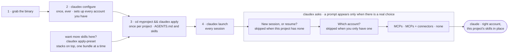

<div align="center">
  
  <h1>ClaudeX</h1>

  <a href="https://github.com/tanq16/claudex/actions/workflows/release.yaml"></a>&nbsp;<a href="https://github.com/tanq16/claudex/releases"></a><br><br>
  <a href="#capabilities">Capabilities</a> &bull; <a href="#installation">Installation</a> &bull; <a href="#usage">Usage</a>
</div>

---

ClaudeX is a companion CLI for Claude Code. It sets every account up identically, lays your instructions and skills into a project in the format each coding agent already reads, and composes each session for you, so starting work is one command and a couple of arrow keys.

It is built for juggling several Claude subscriptions. Everything except the account picker works the same on one.

## Capabilities

What you get over plain `claude`:

| | plain `claude` | ClaudeX |
|---|---|---|
| Accounts | one `CLAUDE_CONFIG_DIR`, swapped by hand | all of them found on their own, picked at launch |
| Resuming | only the account you are already in | recent sessions from every account, in one list |
| Skills | marketplace installs, pinned versions, orphans left behind | `claudex apply` puts them in the project, read by Claude Code and by every agent following the Agent Skills layout |
| Instructions | one `CLAUDE.md` per tool, copied around | one `AGENTS.md`, symlinked to whatever each tool looks for |
| Usage limits | a dashboard in the browser | `claudex status`, all accounts at once |

The commands:

| Command | What it does |
|---------|--------------|
| `configure` | Sets up every account and the shared defaults. Run once after installing |
| `apply` | Writes the base layout into a project: `AGENTS.md`, the base skills, and the symlinks each tool reads them through |
| `apply-preset` | Adds a named bundle of skills and its own `AGENTS.md` section on top of `apply` |
| `create-preset` | Scaffolds a preset of your own, discovered exactly like the built-in one |
| `clean-cwd` | Takes the layout back out of a project |
| `launch` | Starts a Claude Code session with the right account and MCP mode |
| `status` | Usage across all accounts: the 5-hour session window, the weekly overall window, and the weekly per-model windows, each with a reset countdown |
| `switch` | Moves a conversation to another account and continues it there |
| `oauth-token` | Prints a Claude OAuth access token from the browser PKCE flow |

Four steps, and only the last repeats:


```mermaid
%%{init: {'flowchart': {'wrappingWidth': 260}}}%%
flowchart LR
    I["1 · grab the binary"]
    C["2 · claudex configure<br/>once, ever · sets up every account you have"]
    A["3 · cd myproject && claudex apply<br/>once per project · AGENTS.md and skills"]
    L["4 · claudex launch<br/>every session"]

    I --> C --> A --> L

    subgraph ASK ["claudex asks · a prompt appears only when there is a real choice"]
    direction TB
        Q1["New session, or resume?<br/>skipped when this project has none"]
        Q2["Which account?<br/>skipped when you only have one"]
        Q3["MCPs · MCPs + connectors · none"]
        Q1 --> Q2 --> Q3
    end

    L --> Q1
    Q3 --> OUT(["claude · right account,<br/>this project's skills in place"])

    P["want more skills here?<br/>claudex apply-preset<br/>stacks on top, one bundle at a time"]
    P --> A

    style ASK fill:#f6f6ff,stroke:#88a
```

## Installation

### Binary

Download from [releases](https://github.com/tanq16/claudex/releases):

```bash
# Linux/macOS
curl -sL https://github.com/tanq16/claudex/releases/latest/download/claudex-$(uname -s | tr '[:upper:]' '[:lower:]')-$(uname -m | sed 's/x86_64/amd64/;s/aarch64/arm64/') -o claudex
chmod +x claudex
sudo mv claudex /usr/local/bin/
```

### Build from Source

```bash
git clone https://github.com/tanq16/claudex
cd claudex
make build
```

## Usage

No command needs a flag. Run `claudex configure` once, `claudex apply` once per project, then `claudex launch`. The flags below exist to skip prompts when scripting.

### `configure`

Run this once, right after installing. With no arguments it provisions every account it discovers in a single pass:

- **Per account**: a statusline and a set of opinionated `settings.json` defaults. Existing settings and env vars are preserved and only ClaudeX's keys are merged in.
- **The global plugin**: built at `~/.config/claudex/global` and shared by every account. It carries a `.lsp.json` wiring up the Go, Python, and TypeScript language servers, and nothing else, because everything in that directory loads into every session.
- **Presets**: `~/.config/claudex/presets/`, where the built-in `private` preset is laid down from the binary and refreshed on every run. Presets of your own live here too and are never touched.

The base skills need no directory here. They come straight out of the binary when you run `apply`.

`-A <path>` targets a single account. `--label` names that account's statusline and only applies with `-A`.

```bash
claudex configure
claudex configure -A ~/.claude2 --label prod
```

**Language servers ship on by default.** The global plugin's `.lsp.json` gives Claude go-to-definition, find-references, and type errors after every edit, in every session, with no build step. You install the binaries yourself. A server whose binary is missing is skipped and the rest still start, so a partial install is fine, and `/plugin` (Errors tab) reports a missing one.

| Language | Binary | Install |
|---|---|---|
| Go | `gopls` | `go install golang.org/x/tools/gopls@latest` |
| Python | `pyright-langserver` | `npm install -g pyright` |
| TypeScript / JS | `typescript-language-server` | `npm install -g typescript-language-server typescript@5` |

`typescript` is a second package, not a typo. The server drives `tsserver` and ships without it, resolving it from the project's `node_modules` first and falling back to the global install. The `@5` pin matters: `typescript@latest` is 7.x, which no longer ships a `tsserver` binary, and the language server refuses to start against it.

Language servers are not MCP, so `--mcp none` leaves them running. `claude --bare` is what skips them.

**Accounts are found, never created.** ClaudeX picks up `~/.claude` and any numbered sibling (`~/.claude2`, `~/.claude3`, and so on). To add one, point Claude Code at a fresh directory and log in there with `CLAUDE_CONFIG_DIR=~/.claude2 claude`, then run `configure` again.

### `apply`

Run this once in a project. It writes the layout every coding agent reads, and commits nothing to the repo:

```
AGENTS.md                   # the real file, your instructions
CLAUDE.md      -> AGENTS.md
.agents/skills/<skill>      # the base skills, straight from the binary
.claude/skills -> ../.agents/skills
```

The base set is two skills you invoke by name. `skill-creator` writes a new skill in the Agent Skills format and sized to the context budget. `session-summary` pauses a session into `.agents/session-resume/resume.md` and resumes from it later. Everything beyond those comes from a preset.

`AGENTS.md` sits where every other tool already looks for it, and `CLAUDE.md` symlinks to it because Claude Code reads that name instead. Skills work the same way round: `.agents/skills/` is the [Agent Skills](https://agentskills.io) convention Cursor and Codex scan on their own, and `.claude/skills` points at it for Claude Code. Both symlinks exist only for Claude, and everything else finds the real files without help.

**It leaves no diff in someone else's repo.** The four paths go into `.git/info/exclude`, which is local to your clone and never pushed, rather than into a tracked `.gitignore`. Outside a git repository that step is skipped silently and everything else still happens, so run `apply` again after a later `git init`.

ClaudeX's part of `AGENTS.md` sits between `<!-- claudex:base -->` markers, so a re-apply refreshes it and leaves anything you wrote around it alone. Re-running `apply` also refreshes the base skills from the binary, which is how an upgrade reaches a project. Removal is never automatic; `clean-cwd` is the one command that takes any of this back out.

```bash
claudex apply
```

### `apply-preset`

A preset is a bundle of skills plus a section it adds to `AGENTS.md`. Run it after `apply`. Presets stack, so you can apply several.

```bash
claudex apply-preset                 # pick from the list, space to toggle
claudex apply-preset private         # or name them directly
```

**`private`** ships in the binary and is laid down in `~/.config/claudex/presets/` by `configure`. It is the author's own working set rather than a neutral default: 30 skills covering Go and Node project layout, idioms, CLI surface, servers, auth, frontends, concurrency, Makefiles, containers, releases, README, and unit testing, plus the `develop` entry point and the `review-code` audit. Its `AGENTS.md` section adds development, pull request, and operating principles, and the operating half names one particular machine's paths. Everything portable is in the base `apply` instead, so build your own preset rather than adopting this one.

Preset skills are symlinked from that directory into `.agents/skills/`, one link per skill, so editing a preset reaches every project using it. Each preset's contribution to `AGENTS.md` is wrapped in `<!-- claudex:preset:<name> -->` markers and replaced in place, so applying twice changes nothing the second time.

### `create-preset`

Scaffolds a preset of your own at `~/.config/claudex/presets/<name>/`. Yours and the built-in one are discovered the same way, with no registration step:

```
~/.config/claudex/presets/<name>/
├── preset.yaml             # name and the description shown in the picker
├── AGENTS.partial.md       # the section this preset adds to AGENTS.md
└── skills/<skill>/         # the skills it brings
```

`preset.yaml` may list `skills:` explicitly. Left out, every skill under `skills/` is included. Tracking the directory in git is up to you.

```bash
claudex create-preset go-web
```

### `clean-cwd`

Removes what `apply` wrote here: `.agents/`, the `CLAUDE.md` and `.claude/skills` symlinks, ClaudeX's marked sections of `AGENTS.md`, and the `.git/info/exclude` block. Prose you wrote around those markers stays, `AGENTS.md` is deleted only when nothing of yours is left in it, and your own `.claude/settings.json` is untouched.

This is the only command that removes anything, and it exists so removal is always something you asked for. That is why `apply` has no wipe-and-rebuild flag: your instructions live in these files.

```bash
claudex clean-cwd
```

### `launch`

The one command you run to start working. Run it in your project and it asks only what it needs to, then execs straight into `claude`:

```
  MCP + Connectors
  › MCPs only
    MCPs + Connectors
    None

  enter select · esc cancel
```

Arrow keys and enter are the whole interface. A prompt appears only when there is a real choice to make, so with one account and no prior sessions here, the one above is all you see. In order, launch asks:

- **New session, or resume?** Only when this project already has sessions. Resuming lists recent ones across every account and targets the right one for you, and with a single session it skips the list and resumes it directly.
- **Which account?** Only when you have more than one.
- **MCP + connectors.** MCPs only, MCPs plus claude.ai connectors such as Gmail and Slack, or none.

Each prompt has a flag that skips it: `-A/--account`, `--mcp mcps|connectors|none`, and `--new`, `--resume`, or `--session <id>`. `--resume` takes the latest when there is one session and lists them otherwise. `--session <id>` resumes one directly. Supply all of them for a launch that never prompts.

The global plugin loads every launch, so language servers are always there. Launching before you have run `configure` works too and lays down anything missing without touching what you have customized. Skills are not part of it: they come from `claudex apply` in the project you launch from.

`--mcp none` suppresses every MCP server for the session. It does not touch language servers, which are not MCP.

```bash
claudex launch
claudex launch -A ~/.claude2 --mcp none --new   # never prompts
```

### `status`

Usage for every account at once: the 5-hour session window, the weekly overall window, and the weekly per-model windows (currently Fable), each with a reset countdown. One glance tells you which account has room and which is about to hit a limit.

Numbers come from Anthropic's OAuth usage API, the same source as the official dashboard. Tokens are read from the macOS Keychain, or from each account's `.credentials.json` on Linux and Windows, and refresh on their own while Claude Code is running. If one shows as expired, launch Claude Code on that account to refresh it.

```bash
claudex status
claudex status -A ~/.claude2
claudex status -j          # json
```

### `switch`

Moves the current directory's project to another account so you can pick the thread back up there. It works out which account the project lives in by its most-recent session, then moves that account's sessions for it, files and history entries both. Run it bare and it switches silently when there is only one other account, or asks which when there are several. `-A/--account` names the target directly, and is a no-op if the project is already there.

```bash
claudex switch
claudex switch -A ~/.claude2
```

### `oauth-token`

A Claude OAuth access token from the browser-based PKCE flow, valid one hour by default. It opens your browser to authenticate and prints the token, and only the token, to stdout, so `TOKEN=$(claudex oauth-token)` works. `--expires-in` and `--port` are there if you need them.

```bash
claudex oauth-token
TOKEN=$(claudex oauth-token)
```

### Global flags

`--debug` turns on structured zerolog output. `--for-ai` switches to plain prefixed text and reads prompt answers from stdin, for driving ClaudeX from a script or an agent. They are mutually exclusive, and `launch` refuses `--for-ai` since it execs into an interactive `claude`.
