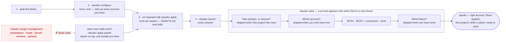

<div align="center">
  
  <h1>ClaudeX</h1>

  <a href="https://github.com/tanq16/claudex/actions/workflows/release.yaml"></a>&nbsp;<a href="https://github.com/tanq16/claudex/releases"></a><br><br>
  <a href="#capabilities">Capabilities</a> &bull; <a href="#installation">Installation</a> &bull; <a href="#usage">Usage</a>
</div>

---

ClaudeX is a companion CLI for Claude Code. It sets your accounts up identically, lays your instructions and skills into a project in the format every coding agent reads, then composes each session for you — right account, right MCP mode, right system prompt — so starting work is one command and a couple of arrow keys.

It shines when you juggle a few Claude subscriptions (personal, work, a spare for when the first hits its limit), but everything except the account picker works exactly the same on one.

## Capabilities

What you get over plain `claude`:

| | plain `claude` | ClaudeX |
|---|---|---|
| Accounts | one `CLAUDE_CONFIG_DIR`, swapped by hand | all of them found on their own, picked at launch |
| Resuming | only sees the account you're already in | recent sessions from every account, in one list |
| System prompt | retype it, or keep it in a file somewhere | flavors — pick a posture at launch |
| Skills | marketplace installs, pinned versions, orphans left behind | `claudex apply` puts them in the project, read by Claude Code and by every agent that follows the Agent Skills layout |
| Instructions | one `CLAUDE.md` per tool, copied around | one `AGENTS.md`, symlinked to whatever each tool looks for |
| Usage limits | a dashboard in the browser | `claudex status`, all accounts at once |

And the commands themselves:

| Command | What it gives you |
|---------|-------------------|
| `configure` | One-shot setup of every account plus the shared defaults — run it once after installing |
| `apply` | The base layout for a project: `AGENTS.md`, the base skills, and the symlinks each tool reads them through |
| `apply-preset` | A named bundle of extra skills plus its own `AGENTS.md` section, stacked on top of `apply` |
| `create-preset` | Scaffolds a preset of your own, discovered exactly like the built-in ones |
| `clean-cwd` | Takes the layout back out of a project |
| `launch` | Guided start of a Claude Code session — right account, MCP mode, and flavor |
| `status` | Live usage across all accounts: 5h session, weekly overall, and weekly per-model windows, each with a reset countdown |
| `switch` | Move a conversation from one account to another and continue it there |
| `oauth-token` | A Claude OAuth access token via the browser PKCE flow |

Four steps, and only the last one repeats:


```mermaid
%%{init: {'flowchart': {'wrappingWidth': 260}}}%%
flowchart LR
    I["1 · grab the binary"]
    C["2 · claudex configure<br/>once, ever — sets up every account you have"]
    A["3 · cd myproject && claudex apply<br/>once per project — AGENTS.md and skills"]
    L["4 · claudex launch<br/>every session"]

    I --> C --> A --> L

    subgraph ASK ["claudex asks — a prompt appears only when there's a real choice"]
    direction TB
        Q1["New session, or resume?<br/>skipped when this project has none"]
        Q2["Which account?<br/>skipped when you only have one"]
        Q3["MCPs · MCPs + connectors · none"]
        Q4["Which flavor?<br/>skipped when you have none"]
        Q1 --> Q2 --> Q3 --> Q4
    end

    L --> Q1
    Q4 --> OUT(["claude — right account, flavor applied,<br/>this project's skills in place, ready to work"])

    P["want more skills here?<br/>claudex apply-preset<br/>stacks on top, one bundle at a time"]
    P --> A

    NATIVE["Claude's plugin management<br/>marketplace · install · pinned versions · orphans"]
    NATIVE -.-x|"✗ never used"| P

    classDef no fill:#fee,stroke:#c66,color:#900,stroke-dasharray:4 3
    class NATIVE no
    style ASK fill:#f6f6ff,stroke:#88a
    linkStyle 9 stroke:#c66,color:#900
```

## Installation

### Binary

Download from [releases](https://github.com/tanq16/claudex/releases):

```bash
# Linux/macOS
curl -sL https://github.com/tanq16/claudex/releases/latest/download/claudex-$(uname -s | tr '[:upper:]' '[:lower:]')-$(uname -m | sed 's/x86_64/amd64/;s/aarch64/arm64/') -o claudex
chmod +x claudex
sudo mv claudex /usr/local/bin/
```

### Build from Source

```bash
git clone https://github.com/tanq16/claudex
cd claudex
make build
```

## Usage

No command needs a flag. Run `claudex configure` once, `claudex apply` once per project, then `claudex launch` — the flags below exist to skip prompts when you're scripting.

### `configure`

Run this once, right after installing. With no arguments it provisions **every account it discovers** in a single pass:

- **Per account** — a statusline and a set of opinionated `settings.json` defaults. Your existing settings and env vars are preserved; only ClaudeX's keys are merged in.
- **The global plugin** — built at `~/.config/claudex/global` and shared by every account. It carries a `.lsp.json` that wires up Go, Python, and TypeScript language servers (see below) and nothing else, because everything in it loads into **every** session; skills reach a project through [`apply`](#apply) instead, so a project you haven't applied to gets none.
- **Presets** — `~/.config/claudex/presets/`, where the built-in `private` preset is laid down from the binary and refreshed on every run. Presets of your own live here too and are never touched. The base skills need no directory here: they come straight out of the binary when you run [`apply`](#apply).
- **Flavors** — creates `~/.config/claudex/flavors/` for your launch-time system-prompt postures (see [`launch`](#launch)).

`-A <path>` targets a single account; `--label` names that account's statusline and only applies with `-A`.

```bash
claudex configure
claudex configure -A ~/.claude2 --label prod
```

**Language servers ship on by default.** The global plugin's `.lsp.json` gives Claude go-to-definition, find-references, and type errors after every edit — no build step — in every session. You install the binaries yourself; a server whose binary is missing is skipped and the rest still start, so a partial install is fine, and `/plugin` (Errors tab) is where a missing one is reported.

| Language | Binary | Install |
|---|---|---|
| Go | `gopls` | `go install golang.org/x/tools/gopls@latest` |
| Python | `pyright-langserver` | `npm install -g pyright` |
| TypeScript / JS | `typescript-language-server` | `npm install -g typescript-language-server typescript@5` |

`typescript` is a second package, not a typo — the server drives `tsserver` and ships without it, resolving it from the project's `node_modules` first and falling back to the global install. The `@5` pin matters: `typescript@latest` is 7.x, which no longer ships a `tsserver` binary, and the language server refuses to start against it. Language servers are not MCP, so `--mcp none` leaves them running; `claude --bare` is what skips them.

**Accounts are found, never created.** ClaudeX picks up `~/.claude` and any numbered sibling (`~/.claude2`, `~/.claude3`, …). To add one, point Claude Code at a fresh directory and log in there — `CLAUDE_CONFIG_DIR=~/.claude2 claude` — then run `configure` again.

### `apply`

Run this once in a project. It writes the layout every coding agent reads, without committing anything to the repo:

```
AGENTS.md                   # the real file — your instructions
CLAUDE.md      -> AGENTS.md
.agents/skills/<skill>      # the base skills, straight from the binary
.claude/skills -> ../.agents/skills
```

The base set is two skills you invoke by name: **`skill-creator`** writes a new skill in the Agent Skills format and sized to the context budget, and **`session-summary`** pauses a session into `.agents/session-resume/resume.md` and resumes from it later. Everything beyond those comes from a preset.

`AGENTS.md` sits where every other tool already looks for it, and `CLAUDE.md` is a symlink to it because Claude Code reads that name instead. Skills work the same way round: `.agents/skills/` is the [Agent Skills](https://agentskills.io) convention Cursor and Codex scan on their own, and `.claude/skills` points at it for Claude Code. Both symlinks exist only for Claude; everything else finds the real files without help.

**It leaves no diff in someone else's repo.** The four paths go into `.git/info/exclude`, which is local to your clone and never pushed — not into a tracked `.gitignore`. Outside a git repository the step is skipped silently, and a later `git init` starts with a fresh exclude file, so re-run `apply` there.

ClaudeX's part of `AGENTS.md` sits between `<!-- claudex:base -->` markers, so a re-apply refreshes it and leaves anything you wrote around it alone. Re-running `apply` also refreshes the base skills from the binary, which is how an upgrade reaches a project. Removal is never automatic — [`clean-cwd`](#clean-cwd) is the one command that takes any of this back out.

```bash
claudex apply
```

### `apply-preset`

A preset is a bundle of extra skills plus a section it adds to `AGENTS.md`. Run it after `apply`; presets stack, so you can apply several.

```bash
claudex apply-preset                 # pick from the list, space to toggle
claudex apply-preset private         # or name them directly
```

**`private`** ships in the binary and is laid down in `~/.config/claudex/presets/` by `configure`. It is the author's own working set rather than a neutral default: the Go and Node conventions — project layout, modern idioms, testing, CLI, backend, frontend, concurrency, CI/CD, README — plus pull request handling, the host environment of one particular machine, the `develop` entry point and the `review-code` audit. Everything portable lives in the base [`apply`](#apply) instead, so build your own preset rather than adopting this one.

Preset skills are symlinked from that directory into `.agents/skills/`, one link per skill, so editing a preset reaches every project using it. Each preset's contribution to `AGENTS.md` is wrapped in `<!-- claudex:preset:<name> -->` markers and replaced in place, so applying twice changes nothing the second time.

### `create-preset`

Scaffolds a preset of your own at `~/.config/claudex/presets/<name>/`. Yours and the built-in ones are discovered the same way, with no registration step:

```
~/.config/claudex/presets/<name>/
├── preset.yaml             # name and the description shown in the picker
├── AGENTS.partial.md       # the section this preset adds to AGENTS.md
└── skills/<skill>/         # the skills it brings
```

`preset.yaml` may list `skills:` explicitly; left out, every skill under `skills/` is included. Tracking the directory in git is up to you.

```bash
claudex create-preset go-web
```

### `clean-cwd`

Removes what `apply` wrote here: `.agents/`, the `CLAUDE.md` and `.claude/skills` symlinks, ClaudeX's marked sections of `AGENTS.md`, and the `.git/info/exclude` block. Prose you wrote around those markers stays, and `AGENTS.md` is only deleted when nothing of yours is left in it; your own `.claude/settings.json` is untouched.

This is the only command that removes anything, and it exists so removal is always something you asked for — which is why `apply` has no wipe-and-rebuild flag. Your instructions live in these files.

```bash
claudex clean-cwd
```

### `launch`

The one command you run to start working. Run it in your project and it asks only what it needs to, then execs straight into `claude`:

```
  MCP + Connectors
  › MCPs only
    MCPs + Connectors
    None

  enter select · esc cancel
```

Arrow keys and enter — that's the whole interface. A prompt only appears when there's a real choice to make, so with one account, no prior sessions here, and no flavors yet, the one above is all you see. In order, launch asks:

- **New session, or resume?** — only when this project already has sessions. Resuming lists recent ones across *every* account and targets the right one for you; with a single session it skips the list and resumes it directly.
- **Which account?** — only when you have more than one.
- **MCP + connectors** — MCPs only, MCPs plus claude.ai connectors (Gmail, Slack, …), or none.
- **Which flavor?** — only when you have flavors to choose between.

Each prompt has a flag that skips it, for scripting: `-A/--account`, `--mcp mcps|connectors|none`, `--flavor <name>` / `--no-flavor`, and `--new`, `--resume`, or `--session <id>`. `--resume` takes the latest when there's one session, else lists them; `--session <id>` resumes one directly. Supply all of them for a launch that never prompts.

The global plugin loads every launch, so language servers are always there. Launching before you've run `configure` works too — it lays down anything missing without touching what you've customized. Skills are not part of it: they come from `claudex apply` in the project you launch from.

**Flavors** are reusable launch-time postures — one `.md` file per posture in `~/.config/claudex/flavors/`, where the whole file becomes the appended system prompt and the filename is its label. `default.md` is a convenience, not a master switch:

| `flavors/` contains | Behavior at launch |
|---|---|
| nothing | nothing applied, no prompt |
| only `default.md` | applied silently — no prompt |
| `default.md` + others | pick one (`default` pre-selected) or None |
| others, no `default.md` | pick one or None |

`--mcp none` suppresses **every** MCP server for the session. It does not touch language servers, which are not MCP; `claude --bare` is what skips those.

```bash
claudex launch
claudex launch -A ~/.claude2 --mcp none --new --no-flavor   # never prompts
```

### `status`

Live usage for every account at once — the 5-hour session window, the weekly overall window, and the weekly per-model windows (currently Fable), each with a reset countdown. One glance tells you which account has room and which is about to hit a limit.

Numbers come straight from Anthropic's OAuth usage API, the same source as the official dashboard. Tokens are read from the macOS Keychain, or from each account's `.credentials.json` on Linux/Windows, and refresh on their own while Claude Code is running; if one shows as expired, launch Claude Code on that account to refresh it.

```bash
claudex status
claudex status -A ~/.claude2
claudex status -j          # json
```

### `switch`

Moves the current directory's project to another account, so you can pick the thread right back up there. It works out which account the project lives in (by its most-recent session) and moves that account's sessions for it — files and history entries both. Run it bare and it switches silently when there's only one other account, or asks which when there are several. `-A/--account` names the target directly (a no-op if the project is already there).

```bash
claudex switch
claudex switch -A ~/.claude2
```

### `oauth-token`

A Claude OAuth access token via the browser-based PKCE flow, valid one hour by default. It opens your browser to authenticate and prints the token — and only the token — to stdout, so `TOKEN=$(claudex oauth-token)` just works. `--expires-in` and `--port` are there if you need them.

```bash
claudex oauth-token
TOKEN=$(claudex oauth-token)
```

### Global flags

`--debug` turns on structured zerolog output; `--for-ai` switches to plain prefixed text and reads prompt answers from stdin, for driving ClaudeX from a script or an agent. They're mutually exclusive, and `launch` refuses `--for-ai` since it execs into an interactive `claude`.
